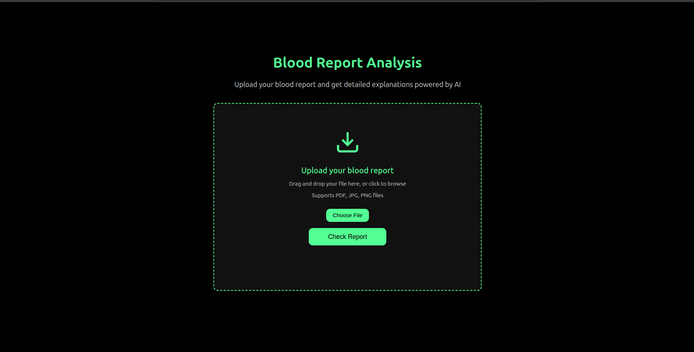

# 🧾 LLM-based Health Report Analyzer

This project is an **AI-powered Health Report Analyzer** that extracts
information from medical reports (e.g., blood test results) and provides
a natural language explanation for patients. It integrates **LLaMA
Vision** (for document understanding) and **LLaMA LLM** (for
explanation) via **Groq API**, with a **Flask backend** and a simple
**HTML/CSS frontend**.

------------------------------------------------------------------------

## 🚀 Features

-   📄 **Image-based Input** -- Upload medical reports as images.
-   🔍 **Vision-powered Extraction** -- Uses **LLaMA Vision** to detect
    and extract key values from the report.
-   🤖 **LLM Explanation** -- LLaMA LLM explains the extracted data in
    **human-friendly language**.
-   🌐 **Web Application** -- Flask backend for processing, HTML/CSS
    frontend for user interaction.
-   ⚡ **Groq-powered Inference** -- Fast and efficient LLaMA inference
    using Groq API.

------------------------------------------------------------------------

## 🏗️ Tech Stack

-   **Backend**: Flask (Python)
-   **Frontend**: HTML, CSS, JavaScript
-   **AI Models**: LLaMA Vision + LLaMA LLM (via Groq)
-   **Environment**: Python 3.9+

------------------------------------------------------------------------

## 📂 Project Structure

├── app.py \# Flask backend ├── explainer.py \# LLM explanation logic
├── extractor.py \# Vision model for data extraction ├── static/ \# CSS,
JS, and assets ├── templates/ \# HTML frontend ├── requirements.txt \#
Python dependencies └── README.md \# Project documentation

------------------------------------------------------------------------

## ⚙️ Installation & Setup

1.  **Clone the repository**

``` bash
git clone https://github.com/your-username/health-report-analyzer.git
cd health-report-analyzer
```

2.  **Create and activate a virtual environment**

``` bash
python -m venv venv
source venv/bin/activate   # On Mac/Linux
venv\Scripts\activate      # On Windows
```

3.  **Install dependencies**

``` bash
pip install -r requirements.txt
```

4.  **Set environment variable**

``` bash
GROQ_LLM = your_groq_api_key
GROQ_VISION = your_groq_vision_api_key
```

------------------------------------------------------------------------

## 🎯 Usage

1.  Upload a health report image.\
2.  Extracted medical values appear on the interface.\
3.  LLaMA LLM provides a clear, human-friendly explanation.\
4.  View results in the web interface.

------------------------------------------------------------------------

## 📸 Screenshots



------------------------------------------------------------------------

## 🛠️ Future Improvements

✅ Support for PDF reports\
✅ Multi-language support\
✅ Doctor's recommendation summaries\
✅ Store user history for tracking progress

------------------------------------------------------------------------